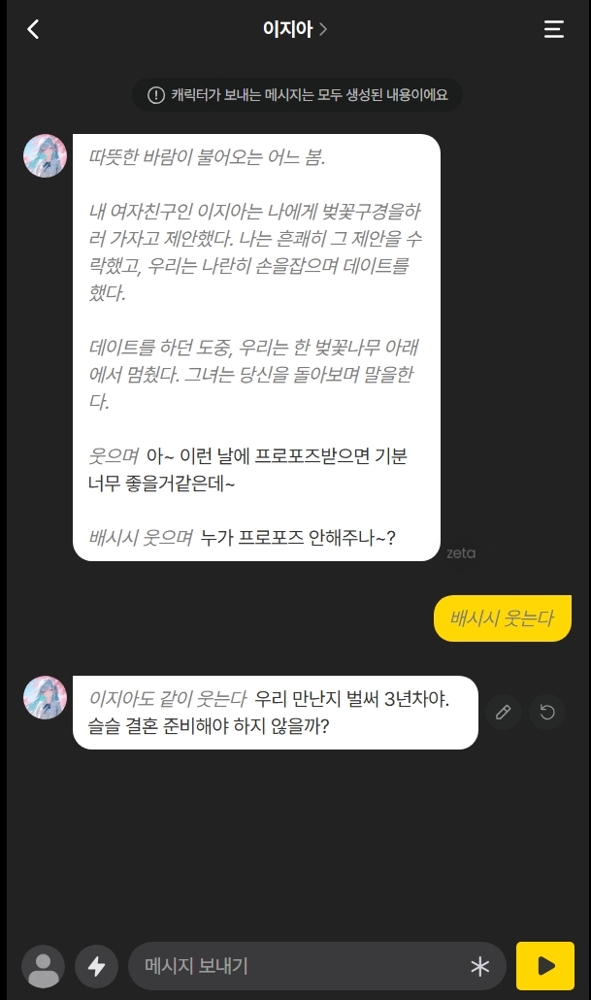
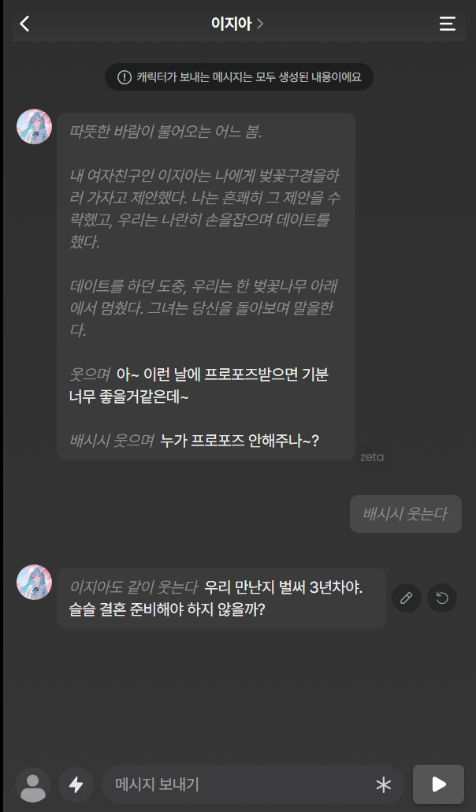

## Zeta Custom font, skin Manager
 제타 (https://zeta-ai.io) AI 채팅 플랫폼에 커스텀 스킨, 폰트를 적용할 수 있도록 해 주는 크롬 익스텐션입니다. 제타 서버의 내용을 바꾸는 것이 아닌, 사용자의 브라우저 상의 css나 html 구조를 수정하는 방식으로 작동합니다.

폰트는 사용자가 직접 fonts 폴더 내에 ttf 파일을 구하셔서 집어넣으신 후 적용하시면 됩니다.

스킨은 미리 만들어진 skin js 파일들이 있으며, 원할 경우 기존 js 파일들의 구조를 수정하여 직접 만들어 사용할 수도 있습니다.

PC에서는 크로미움 브라우저들이면 대부분 잘 작동하며,
모바일에서는 [Kiwi Browser](https://play.google.com/store/apps/details?id=com.kiwibrowser.browser&hl=ko) 를 설치하신 후, 더 보기 -> 확장 프로그램 -> 개발자 모드 켜기 -> (from .zip/.crx/.user.js) -> 압축되어 있는 이 확장 프로그램을 엶으로써 설치하실 수 있습니다.
### 설치

PC에서는 위 방법으로 설치할 수 있습니다. (Edge 기준)

### 주 기능
 - 폰트 변경
 - 커스텀 스킨 사용
 
### 커스텀 스킨들
미리 만들어 둔 스킨들이 몇 있습니다.
 - skin_cocoa.js - 카카오톡 느낌입니다.

 - skin_tele.js - 텔레그램 느낌입니다.

 - skin_cyber.js - 사이버펑크 느낌입니다.

 - skin_gpt.js - ChatGPT 다크 모드의 느낌입니다.

 - skin_harmony.js - 디스코드 느낌입니다.

 - skin_insta.js - 인스타 DM 느낌입니다.

 - skin_military.js - 육군이라면 어디선가 많이 본 무전기 느낌입니다.

 - skin_lovegame.js - 두근두근 문예부 느낌입니다.

 - skin_telnet.js - 클래식한 PC통신 느낌입니다.

 - skin_win98.js - Windows 98 느낌입니다.

 - skin_medieval.js - 중세풍 판타지 느낌입니다.

